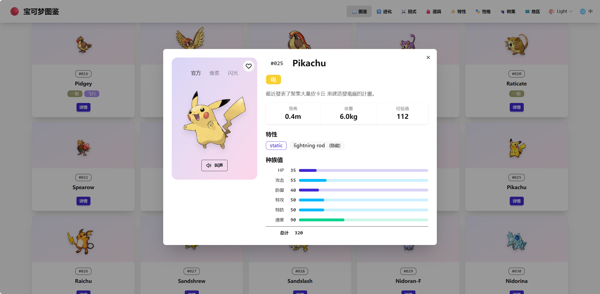
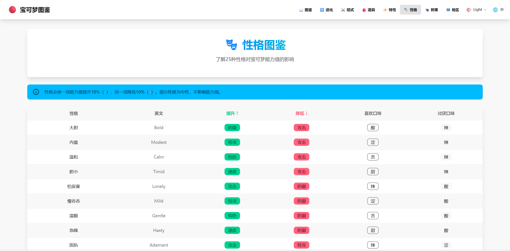
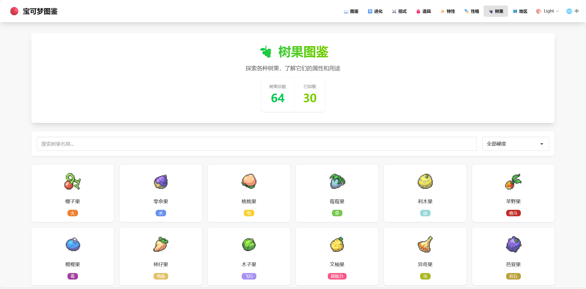

# PokeAPI Nuxt Frontend

这是一个基于 [Nuxt 4](https://nuxt.com) 构建的现代化宝可梦百科全书应用。它利用 [PokeAPI](https://pokeapi.co/) 提供关于宝可梦、招式、道具等的详细信息。

## ✨ 功能特性

本系统包含以下核心功能：

*   **📖 宝可梦图鉴 (Pokedex)**
    *   浏览完整的宝可梦列表。
    *   支持按名称搜索和按属性（Type）筛选。
    *   查看宝可梦详细信息：基础数值、属性、特性、进化链等。
    *   收藏功能：标记你喜欢的宝可梦。
    *   统计面板：显示总数、已加载数量和收藏数量。

*   **🔄 进化链 (Evolution)**
    *   探索宝可梦的进化路径和条件。

*   **⚔️ 招式 (Moves)**
    *   查询宝可梦招式的详细数据（威力、命中率、PP等）。

*   **🎒 道具 (Items)**
    *   浏览游戏中的各种道具及其用途。

*   **✨ 其他数据查询**
    *   **特性 (Abilities)**: 查看宝可梦特性的详细说明。
    *   **树果 (Berries)**: 树果相关信息。
    *   **性格 (Natures)**: 宝可梦性格对数值的影响。
    *   **地区 (Regions)**: 宝可梦世界的地区和地点信息。

*   **🎨 用户体验**
    *   **多语言支持**: 支持中英文切换。
    *   **主题切换**: 支持明亮/暗黑模式。
    *   **响应式设计**: 完美适配桌面和移动端设备，基于 Tailwind CSS 4 和 DaisyUI 5。

## 🍔系统截图

|  |  |  |
|:---:|:---:|:---:|
|  |  |  |
|  |  |  |

## 🛠️技术栈

*   **框架**: [Nuxt 4](https://nuxt.com/) (Vue 3)
*   **样式**: [Tailwind CSS 4](https://tailwindcss.com/)
*   **UI 组件库**: [DaisyUI 5](https://daisyui.com/)
*   **图标**: [Heroicons](https://heroicons.com/)
*   **API**: [PokeAPI](https://pokeapi.co/)

## 🚀 快速开始

查看 [Nuxt 文档](https://nuxt.com/docs/getting-started/introduction) 了解更多。

### 安装依赖

```bash
# npm
npm install

# pnpm
pnpm install

# yarn
yarn install

# bun
bun install
```

### 启动开发服务器

在 `http://localhost:3000` 启动开发服务器：

```bash
# npm
npm run dev

# pnpm
pnpm dev

# yarn
yarn dev

# bun
bun run dev
```

### 生产环境构建

构建生产环境应用：

```bash
# npm
npm run build

# pnpm
pnpm build

# yarn
yarn build

# bun
bun run build
```

本地预览生产构建：

```bash
# npm
npm run preview

# pnpm
pnpm preview

# yarn
yarn preview

# bun
bun run preview
```

查看 [部署文档](https://nuxt.com/docs/getting-started/deployment) 获取更多信息。
